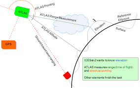

# interactive_arctic_mapping
A set of template files to include an interactive map of the Arctic in a website using Django

This repository enables you to create an interactive map hosted on a website that uses a stereographic projection.

The files follow the basic django framework:

Learn about installing and using django [here](https://www.djangoproject.com)

Here, the ATL03_trackfinder module uses backscattered photons from the elastic LIDAR onboard the IceSAT2 satellite. It identifies the tracks in a given time period, and presents those tracks as interactive paths for the user to select.
The mapped tracks are from the LIDAR returns as shown below.

To solely utilize the interactive mapping aspect (which can be done outside of the django framework), use the makemap function in the ATL03_trackfinder module. This allows you to plot latitudes and longitudes and select the path, returning a unique identifier for each path. This can be adjusted to have different effects when the user mouses over or clicks on the path, learn more at [the mpld3 github page](https://mpld3.github.io) 
