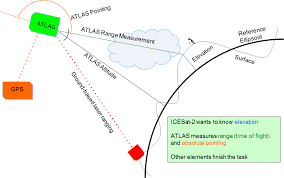

# interactive_arctic_mapping
A set of template files to include an interactive map of the Arctic in a website using Django

This repository enables you to create an interactive map hosted on a website that uses a stereographic projection.

The files follow the basic django framework:

Here, the ATL03_trackfinder module uses backscattered photons from the elastic LIDAR onboard the IceSAT2 satellite. It identifies the tracks in a given time period, and presents those tracks as interactive paths for the user to select.
The mapped tracks are from the LIDAR returns as shown below.

